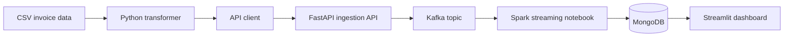

# Document Streaming

This repository is a small data-streaming project built around retail invoice data. It takes rows from a CSV file, sends them through a FastAPI endpoint and Kafka, processes the stream with Spark, stores the result in MongoDB, and displays invoice data in Streamlit.

## Data flow



1. `client/transformer.py` reads `client/data.csv`, converts the invoice dates, and writes newline-delimited JSON to `client/output.txt`.
2. `client/api-client.py` sends the records to the FastAPI ingestion endpoint.
3. `api_ingest/app/main.py` validates each invoice, reformats its date, and publishes it to the Kafka topic `ingestion-topic`.
4. The Spark notebooks read the Kafka topic and write the records to MongoDB.
5. `streamlit/streamlitapp.py` queries MongoDB and displays invoices by customer or invoice number.

## Services

| Service | Purpose | Local address |
| --- | --- | --- |
| FastAPI | Receives invoice records and publishes them to Kafka | `http://localhost:80` |
| FastAPI docs | Interactive API documentation | `http://localhost:80/docs` |
| Kafka | Event stream | `localhost:9093` from the host |
| Spark/Jupyter | Reads Kafka and writes to MongoDB | `http://localhost:8888` |
| MongoDB | Stores processed invoices | `localhost:27017` |
| Mongo Express | Browser-based MongoDB administration | `http://localhost:8081` |
| Streamlit | Invoice dashboard | `http://localhost:8501` |

## Run locally

### Requirements

- Docker Desktop with Docker Compose
- Python 3 with `pandas`, `requests`, `pymongo`, and `streamlit` for the scripts that run on the host
- A `client/data.csv` file containing the invoice data

### 1. Configure local credentials

Copy the example environment file and replace all placeholder values with local passwords:

```powershell
Copy-Item .env.example .env
notepad .env
```

The `.env` file is ignored by Git. Do not commit it.

### 2. Build the ingestion API image

```powershell
docker build -t api_ingest -f .\api_ingest\dockerfile .\api_ingest
```

### 3. Start the stack

```powershell
docker compose -f docker-compose-kafka-spark-mongodb.yml up -d
docker compose -f docker-compose-kafka-spark-mongodb.yml logs -f
```

The first startup can take a while because Docker has to download the images. Open Jupyter at `http://localhost:8888`, then run `spark/02-streaming-kafka-src-dst-mongodb.ipynb` to start the Kafka-to-MongoDB stream. The notebook does not run automatically when the container starts.

### 4. Prepare and send invoice data

```powershell
py .\client\transformer.py
cd .\client
py .\api-client.py
cd ..
```

The API client currently sends the first 5,000 lines. Change the `end` value in `client/api-client.py` if a different amount is needed.

### 5. Start Streamlit

Streamlit runs on the host, so it needs the same MongoDB credentials as Docker Compose:

```powershell
$env:MONGO_USERNAME = "your-local-username"
$env:MONGO_PASSWORD = "your-local-password"
$env:MONGO_DATABASE = "docstreaming"
py -m streamlit run .\streamlit\streamlitapp.py
```

Open `http://localhost:8501` if the browser does not open automatically.

### Stop the stack

```powershell
docker compose -f docker-compose-kafka-spark-mongodb.yml down
```