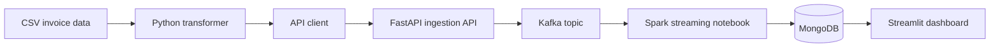

# Document Streaming

This repository is a small data-streaming project built around retail invoice data. It takes rows from a CSV file, sends them through a FastAPI endpoint and Kafka, processes the stream with Spark, stores the result in MongoDB, and displays invoice data in Streamlit.

The project is intended for local development and learning. It shows how the individual parts of a streaming pipeline fit together, but it is not ready for a public production environment without more work.

## Data flow



1. `client/transformer.py` reads `client/data.csv`, converts the invoice dates, and writes newline-delimited JSON to `client/output.txt`.
2. `client/api-client.py` sends the records to the FastAPI ingestion endpoint.
3. `api_ingest/app/main.py` validates each invoice, reformats its date, and publishes it to the Kafka topic `ingestion-topic`.
4. The Spark notebooks read the Kafka topic and write the records to MongoDB.
5. `streamlit/streamlitapp.py` queries MongoDB and displays invoices by customer or invoice number.

The CSV and generated output files are intentionally excluded from Git.

## Services

| Service | Purpose | Local address |
| --- | --- | --- |
| FastAPI | Receives invoice records and publishes them to Kafka | `http://localhost:80` |
| FastAPI docs | Interactive API documentation | `http://localhost:80/docs` |
| Kafka | Event stream | `localhost:9093` from the host |
| Spark/Jupyter | Reads Kafka and writes to MongoDB | `http://localhost:8888` |
| MongoDB | Stores processed invoices | `localhost:27017` |
| Mongo Express | Browser-based MongoDB administration | `http://localhost:8081` |
| Streamlit | Invoice dashboard | `http://localhost:8501` |

## Run locally

### Requirements

- Docker Desktop with Docker Compose
- Python 3 with `pandas`, `requests`, `pymongo`, and `streamlit` for the scripts that run on the host
- A `client/data.csv` file containing the invoice data

### 1. Configure local credentials

Copy the example environment file and replace all placeholder values with local passwords:

```powershell
Copy-Item .env.example .env
notepad .env
```

The `.env` file is ignored by Git. Do not commit it.

### 2. Build the ingestion API image

```powershell
docker build -t api_ingest -f .\api_ingest\dockerfile .\api_ingest
```

### 3. Start the stack

```powershell
docker compose -f docker-compose-kafka-spark-mongodb.yml up -d
docker compose -f docker-compose-kafka-spark-mongodb.yml logs -f
```

The first startup can take a while because Docker has to download the images. Open Jupyter at `http://localhost:8888`, then run `spark/02-streaming-kafka-src-dst-mongodb.ipynb` to start the Kafka-to-MongoDB stream. The notebook does not run automatically when the container starts.

### 4. Prepare and send invoice data

```powershell
py .\client\transformer.py
cd .\client
py .\api-client.py
cd ..
```

The API client currently sends the first 5,000 lines. Change the `end` value in `client/api-client.py` if a different amount is needed.

### 5. Start Streamlit

Streamlit runs on the host, so it needs the same MongoDB credentials as Docker Compose:

```powershell
$env:MONGO_USERNAME = "your-local-username"
$env:MONGO_PASSWORD = "your-local-password"
$env:MONGO_DATABASE = "docstreaming"
py -m streamlit run .\streamlit\streamlitapp.py
```

Open `http://localhost:8501` if the browser does not open automatically.

### Stop the stack

```powershell
docker compose -f docker-compose-kafka-spark-mongodb.yml down
```

MongoDB data is stored outside the container under `~/dockerdata/mongodb`, so stopping the stack does not remove the database.

## Current limitations

- Streamlit connects directly to MongoDB.
- The Spark stream is started manually from a notebook.
- Kafka allows plaintext connections and anonymous access.
- MongoDB and Kafka ports are exposed to the host for local development.
- There is no authentication or rate limiting on the ingestion API.
- There are no automated tests, health checks, monitoring, or deployment scripts.
- The Kafka, Spark, MongoDB, Python, and base container versions should be upgraded before production use.
- Docker Compose is useful locally, but it does not provide backups, failover, rolling deployments, or production-grade secret management.

## Next steps

### Put an API between MongoDB and Streamlit

The next useful change is a separate read API. Streamlit should request invoice data from the API instead of holding MongoDB credentials and querying the database directly.

Suggested endpoints:

```text
GET /customers/{customer_id}/invoices
GET /invoices/{invoice_no}
GET /health
```

The read API should:

- use a read-only MongoDB account;
- validate request parameters;
- return clear `404`, `422`, and `500` responses;
- support pagination for large results;
- keep database credentials in environment variables or a cloud secret store;
- include connection timeouts and structured logging;
- have unit and integration tests;
- be available only to Streamlit if there is no reason to expose it publicly.

The existing FastAPI project can be extended with these routes, or ingestion and query APIs can be kept as separate services. Separate services are cleaner when they need different scaling or security rules. Extending the current API is simpler for this project.

### Automate the Spark consumer

Move the working notebook code into a Python application with its own Dockerfile. The consumer should start with the stack, restart after failures, expose a health check, and save Spark checkpoints to persistent storage.

### Add production basics

- Upgrade the old container and library versions.
- Add Dockerfiles for Streamlit and the Spark consumer.
- Use HTTPS and authentication for public endpoints.
- Keep Kafka and MongoDB on private networks.
- Add database backups and a restore test.
- Add CI checks for tests, container builds, and secret scanning.
- Use a registry rather than locally named images.

## Hosting on AWS or Azure

Containerizing the project helps, but the stateful parts still need decisions about storage, networking, backups, and scaling. The API and Streamlit containers are straightforward to host. Kafka, Spark, and MongoDB account for most of the work and cost.

### Option 1: one virtual machine

Run the existing Compose stack on an AWS Lightsail/EC2 instance or an Azure Linux VM.

**Difficulty:** 2 out of 5 for a demo, 4 out of 5 if it must be secure and reliable.

**Cost:** usually the lowest and most predictable option for a small, continuously running demo. Kafka, Spark, and MongoDB need more memory than a simple web application, so a very small VM is unlikely to be comfortable. Start around 8 GB of RAM, measure usage, and resize if necessary.

**Trade-off:** this is close to the local setup, but one VM is one failure point. You are responsible for operating-system updates, TLS, firewall rules, monitoring, MongoDB backups, disk capacity, and restarting failed services. Only ports 80/443 should be public; Kafka, MongoDB, Jupyter, and Mongo Express should remain private.

AWS describes [Lightsail](https://docs.aws.amazon.com/lightsail/latest/userguide/what-is-amazon-lightsail.html) as its simpler, predictable-price option for small applications. Azure offers the equivalent approach with a standard [Linux virtual machine](https://learn.microsoft.com/azure/virtual-machines/linux/overview).

### Option 2: managed AWS services

A more production-oriented AWS layout would use:

- Amazon ECR for container images;
- [Amazon ECS with Fargate](https://docs.aws.amazon.com/AmazonECS/latest/developerguide/getting-started-fargate.html) for the API and Streamlit;
- [Amazon MSK Serverless](https://docs.aws.amazon.com/msk/latest/developerguide/serverless.html) for Kafka;
- [Amazon EMR Serverless](https://docs.aws.amazon.com/emr/latest/EMR-Serverless-UserGuide/emr-serverless.html) for Spark if the streaming job remains part of the design;
- [MongoDB Atlas](https://www.mongodb.com/docs/atlas/) on AWS for the closest match to the current MongoDB code, or another managed document database after checking compatibility;
- AWS Secrets Manager for credentials;
- CloudWatch for logs and alerts.

**Difficulty:** 4 out of 5. The containers are easy to move, but IAM, private networking, load balancing, TLS, service discovery, and Kafka authentication require real changes to the local configuration.

**Cost:** good for a production service that needs scaling and less operational work, but usually poor value for a small learning project that sits idle. Fargate charges for the CPU and memory requested while tasks run, and managed Kafka can be a significant part of the bill. Review the [Fargate pricing model](https://aws.amazon.com/fargate/pricing/) and [MSK pricing](https://aws.amazon.com/msk/pricing/) with the AWS Pricing Calculator before creating resources.

### Option 3: managed Azure services

A comparable Azure layout would use:

- Azure Container Registry for images;
- [Azure Container Apps](https://learn.microsoft.com/azure/container-apps/overview) for the API and Streamlit;
- [Azure Event Hubs with its Kafka endpoint](https://learn.microsoft.com/azure/event-hubs/azure-event-hubs-apache-kafka-overview) instead of running Kafka and ZooKeeper;
- [Azure Cosmos DB for MongoDB](https://learn.microsoft.com/azure/cosmos-db/mongodb/overview) or MongoDB Atlas on Azure;
- Azure Key Vault for credentials;
- Azure Monitor and Log Analytics for logs and alerts;
- Azure Databricks or another managed Spark service if Spark remains necessary.

**Difficulty:** 3 to 4 out of 5. Container Apps is simple for HTTP services and can scale to zero, but Event Hubs uses different authentication and connection settings from this local Kafka setup. Cosmos DB supports the MongoDB wire protocol, but queries and Spark connector behavior should be tested before choosing it.

**Cost:** Container Apps can be cost-effective for a low-traffic API because its consumption plan can scale to zero. The database, Event Hubs, logging, and managed Spark can still create a steady bill. See [Container Apps pricing](https://azure.microsoft.com/pricing/details/container-apps/) and [Event Hubs pricing](https://azure.microsoft.com/pricing/details/event-hubs/) before deployment.

### Practical recommendation

For a portfolio project or short-lived demo, use one VM and Docker Compose. It is the quickest route and keeps the number of cloud services small. Shut the VM down when it is not needed and keep a backup of the MongoDB data.

For a public service with real users, package Streamlit and the Spark consumer properly, add the read API, then use managed containers and a managed database. Move Kafka to MSK Serverless or Event Hubs only if the application genuinely needs streaming at that scale. For low traffic, Kafka and always-on Spark are often the least cost-effective parts of this architecture; a queue plus an on-demand worker may be enough.

AWS and Azure are both reasonable choices. Azure is slightly more direct for a scale-to-zero HTTP demo with Container Apps. AWS is a good fit if keeping standard Kafka through MSK is important. In either cloud, the managed production version is a small architecture project rather than a direct `docker compose up` deployment.
